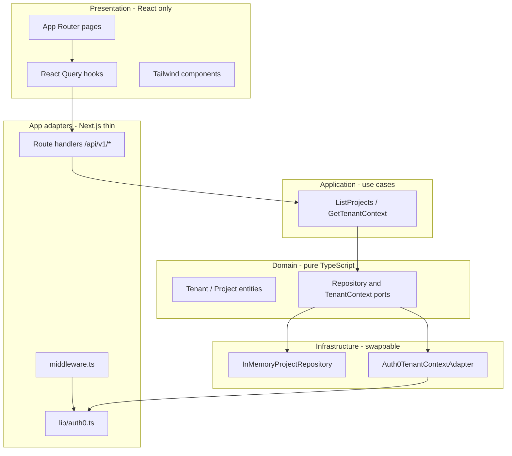
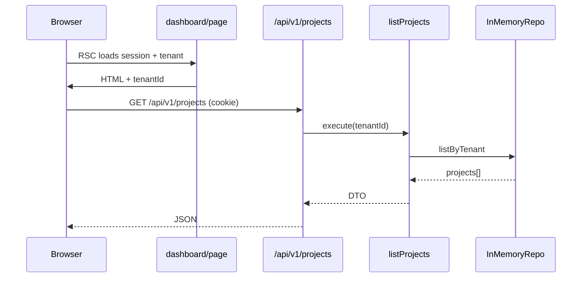

# Multi-tenant SaaS starter (Next.js + Auth0 Organizations)

## Decisions (from your answers)

| Area | Choice |
|------|--------|
| Tenancy | **Auth0 Organizations** — `org_id` in session after login; org chosen via login URL or Auth0 org picker |
| Data (v1) | **No database** — ports + in-memory adapters; swap in Postgres/Prisma later without touching domain code |
| Stack | Next.js App Router, TypeScript, Tailwind, `@auth0/nextjs-auth0` v4, `@tanstack/react-query` |

Default project path: **`~/Projects/multi-tenant-saas`** (create `~/Projects` if missing). Use `create_project` + `move_agent_to_root` before any scaffolding.

---

## Architecture (agnostic layers)



**Rules**

- **`src/domain/`** — zero imports from Next, React, Auth0, or React Query.
- **`src/application/`** — use cases depend only on domain ports; receive `TenantId` explicitly.
- **`src/infrastructure/`** — implements ports (Auth0 session reader, in-memory repos).
- **`src/app/`** + **`src/lib/`** — wiring only: session → use case → JSON response.
- **React Query** lives in **`src/presentation/`** (hooks + providers); query functions call `/api/v1/*`, not use cases directly from the browser.

---

## Project bootstrap

1. **Create repo** via MCP `create_project` at `~/Projects/multi-tenant-saas`.
2. **Move workspace** with `move_agent_to_root` immediately.
3. **Scaffold Next.js** (App Router, `src/`, TypeScript, Tailwind, ESLint):

```bash
npx create-next-app@latest . --ts --tailwind --eslint --app --src-dir --import-alias "@/*"
```

4. **Install runtime deps**:

```bash
npm install @auth0/nextjs-auth0 @tanstack/react-query zod
```

5. **Env template** — [`.env.local.example`](.env.local.example) (committed) documenting:

```bash
AUTH0_SECRET=           # openssl rand -hex 32
APP_BASE_URL=http://localhost:3000
AUTH0_DOMAIN=your-tenant.auth0.com
AUTH0_CLIENT_ID=
AUTH0_CLIENT_SECRET=
# Optional later: AUTH0_AUDIENCE for API tokens / My Org proxy
```

---

## Auth0 Organizations setup (Dashboard + CLI)

Manual Dashboard steps (document in README):

1. Enable **Organizations** on the tenant.
2. Application type: **Regular Web Application** (not SPA).
3. Allowed Callback URLs: `http://localhost:3000/auth/callback`
4. Allowed Logout URLs: `http://localhost:3000`
5. On the application: enable **Organization usage** (login flows require org context per your Auth0 plan).
6. Create 2 test orgs (e.g. `Acme`, `Globex`) and add your user to both for switcher testing.

**Login with org** (SDK v4 — query params forwarded to `/authorize`):

- Link: `/auth/login?organization=org_xxxxxxxx`
- Org switch = logout + login with new `organization` param (simplest v1; re-auth is acceptable for B2B).

**Tenant identity in app** — read `org_id` from session user claims after login ([Auth0 Organizations docs](https://auth0.com/docs/manage-users/organizations)). Wrap in domain type:

```ts
// src/domain/tenant/tenant-id.ts
export type TenantId = string & { readonly __brand: 'TenantId' };
export function TenantId(value: string): TenantId { /* validate org_* */ }
```

**Optional v1 enhancement** (if you enable My Organization API on the app): configure `authorizationParameters.scope` for `https://{AUTH0_DOMAIN}/my-org/` and use SDK’s `/my-org/organizations` proxy to populate an org switcher without hard-coded org IDs. Defer if you want the smallest first slice.

---

## Core files to implement

### Auth0 adapter (Next-specific)

| File | Role |
|------|------|
| [`src/lib/auth0.ts`](src/lib/auth0.ts) | `Auth0Client` instance per [auth0-nextjs skill](file:///Users/trentstrum/.cursor/plugins/cache/cursor-public/auth0/b420ff5783c61da54d49c1bfacf5b1384965a5a1/skills/auth0-nextjs/SKILL.md) |
| [`src/middleware.ts`](src/middleware.ts) | `auth0.middleware(request)` + matcher excluding static assets |

### Domain + application

| File | Role |
|------|------|
| [`src/domain/tenant/tenant.ts`](src/domain/tenant/tenant.ts) | `Tenant { id, name? }` entity |
| [`src/domain/tenant/tenant-context.port.ts`](src/domain/tenant/tenant-context.port.ts) | `getActiveTenant(): Promise<Tenant \| null>` |
| [`src/domain/project/project.ts`](src/domain/project/project.ts) | Sample resource entity |
| [`src/domain/project/project.repository.port.ts`](src/domain/project/project.repository.port.ts) | `listByTenant(tenantId)` |
| [`src/application/tenant/get-tenant-context.ts`](src/application/tenant/get-tenant-context.ts) | Use case |
| [`src/application/project/list-projects.ts`](src/application/project/list-projects.ts) | Use case — requires tenant |
| [`src/infrastructure/auth/auth0-tenant-context.adapter.ts`](src/infrastructure/auth/auth0-tenant-context.adapter.ts) | Maps `session.user.org_id` → `TenantId` |
| [`src/infrastructure/persistence/in-memory-project.repository.ts`](src/infrastructure/persistence/in-memory-project.repository.ts) | Seed a few projects per demo `org_id` |

### Composition root (server-only)

[`src/server/container.ts`](src/server/container.ts) — factory that builds use cases with concrete adapters (single place to swap in Prisma later).

### API routes (thin)

[`src/app/api/v1/projects/route.ts`](src/app/api/v1/projects/route.ts):

1. `auth0.getSession()` — 401 if missing.
2. `getTenantContext` — 403 if no `org_id` (tenant required).
3. `listProjects.execute(tenantId)` — return JSON.

### UI + React Query

| File | Role |
|------|------|
| [`src/presentation/providers/query-provider.tsx`](src/presentation/providers/query-provider.tsx) | `QueryClientProvider` (client component) |
| [`src/presentation/providers/tenant-provider.tsx`](src/presentation/providers/tenant-provider.tsx) | Server-passed `tenant` into client context |
| [`src/presentation/hooks/use-projects.ts`](src/presentation/hooks/use-projects.ts) | `useQuery({ queryKey: ['projects', tenantId], ... })` |
| [`src/presentation/components/org-switcher.tsx`](src/presentation/components/org-switcher.tsx) | Links to `/auth/login?organization=...` for known demo orgs |
| [`src/app/(marketing)/page.tsx`](src/app/(marketing)/page.tsx) | Landing + login CTA |
| [`src/app/(app)/layout.tsx`](src/app/(app)/layout.tsx) | Protected shell: session check, tenant guard |
| [`src/app/(app)/select-org/page.tsx`](src/app/(app)/select-org/page.tsx) | Shown when authenticated but `org_id` missing |
| [`src/app/(app)/dashboard/page.tsx`](src/app/(app)/dashboard/page.tsx) | Projects table via `useProjects` |

**Query key convention** — always prefix with tenant: `['tenant', tenantId, 'projects']` so cache never leaks across orgs.

**Root layout** — [`src/app/layout.tsx`](src/app/layout.tsx): optional `Auth0Provider` with SSR user, `QueryProvider`, Tailwind base styles.

---

## Request flow (dashboard)



---

## Tenant guard behavior

- **Unauthenticated** → redirect to `/auth/login?returnTo=/dashboard`
- **Authenticated, no `org_id`** → redirect to `/select-org` (picker / instructions)
- **Authenticated with `org_id`** → allow `(app)` routes; show org name/id in header

Enforce tenant on **every** `/api/v1/*` handler server-side (never trust client-sent `org_id`).

---

## Styling and UX (minimal v1)

- Tailwind: neutral dashboard layout (sidebar + header with user menu + org switcher).
- Loading/error states on React Query hooks (`isPending`, `isError`, retry).
- Zod-validate API responses in the presentation fetch layer (optional but recommended).

---

## README deliverables

- Local dev: `cp .env.local.example .env.local`, fill Auth0 values, `npm run dev`
- Auth0 org setup checklist
- Layer diagram + “how to add Postgres later” (implement `ProjectRepository` port, register in `container.ts`)
- Note: v1 org switch requires re-login with `?organization=` — document upgrade path to My Org API proxy

---

## Out of scope for v1 (explicit)

- PostgreSQL / Prisma / Drizzle
- Billing, roles/RBAC beyond Auth0 org membership
- Subdomain or path-based tenancy
- E2E tests (add Playwright in a follow-up if you want)

---

## Verification checklist

1. `npm run build` passes.
2. Login → Auth0 org prompt or direct org login URL → lands on `/dashboard` with `org_id` visible in session/debug UI.
3. Projects list shows tenant-scoped mock data; switching org (second login) shows different data.
4. `/api/v1/projects` returns 401 without session, 403 without `org_id`.
